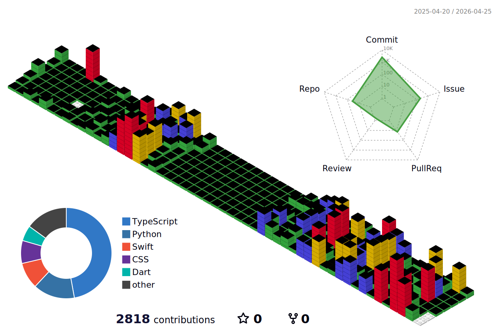

### 🌟 About Me  
Hello! 👋  
I'm **Backend Developer**.  
Always striving to approach every task with a positive mindset. 😇✨

---

#### ⚙️ Technologies I'm Using  

  

    
    
    
    
  

  

    
    
    
    
    
  

 

#### 🐻‍❄️ My Github Activity

<!--  -->
