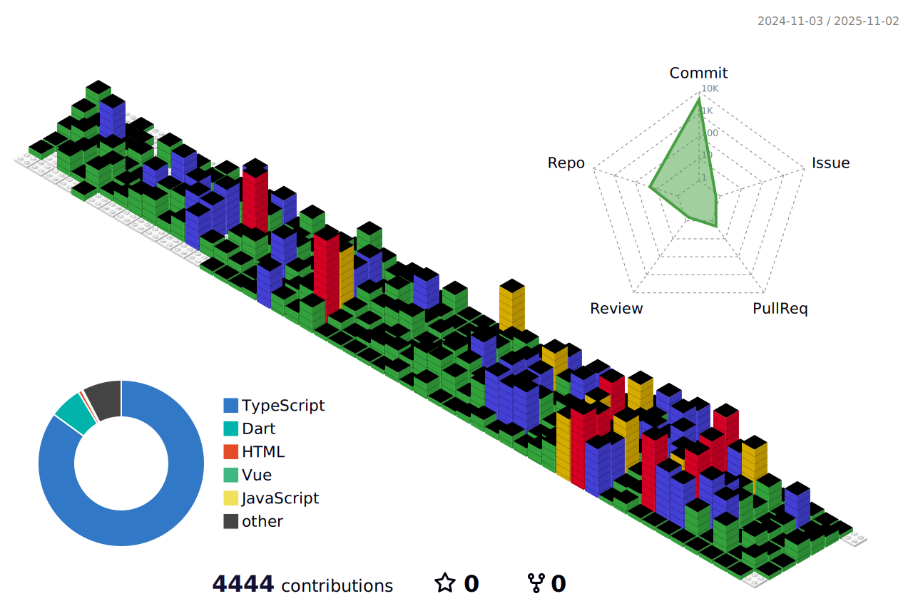

### ✨ About Me  

안녕하세요! 👋  
저는 **프론트엔드 개발자 전승훈**입니다.  
트렌디한 기술을 활용하여 효율적인 사용자 경험을 만들어가는 것을 좋아합니다. 🚀✨  

---

### 💻 Tech Stack  
사용하는 기술들을 한눈에 볼 수 있도록 정리했습니다!  

  

    
    
    
    
    
  

  

    
    
    
    
    
  

  

    
    
    
    
    
  

  

    
    
    
  

---

### GitHub Activity  

